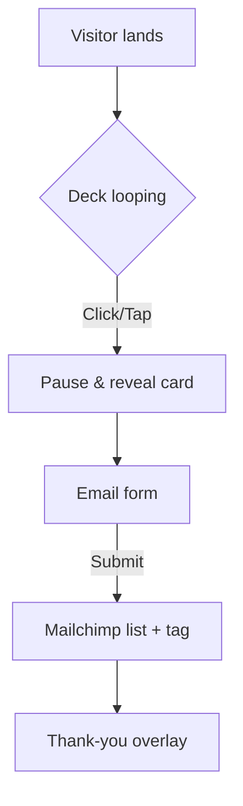

# ✨ Queen de Q – /app Landing Page

## 1  Project Overview

Design & build a magnetic landing page at **queendeq.com/app** that:

1. **Collects verified emails** for the private‑beta "Royal Launch" (places limited).
2. **Immerses visitors in the Kingdom’s vibe** via a looping, stoppable deck of 54 archetype cards.
3. Converts mobile‑first (≥ 375 px) and desktop users equally, with pixel‑perfect, luxurious UI.

> **Primary CTA:** “Deal me a card ↗” → stops the deck → reveals card overlay → opens email form.

## 2  Key Deliverables

* **Hero section** with animated card deck, scarcity copy, and email form.
* **How It Works** 3‑step graphic.
* **Social proof** carousel (quotes, avatars).
* **FAQ accordion** (4–6 common questions).
* **Royal footer** with secondary CTA & legal links.

## 3  User Stories

| Role    | Goal                                               | Reason                            |
| ------- | -------------------------------------------------- | --------------------------------- |
| Visitor | Stop the card shuffle & receive an archetype       | Fun teaser of the future game/app |
| Visitor | Join early‑access list                             | Secure a limited invitation       |
| Admin   | See collected emails in Mailchimp + card drawn tag | Segment future campaigns          |

## 4  Visual Guidelines

* **Palette** (from brand charter):

  * Deep Purple #3B1E50 (bg)
  * Imperial Gold #D6AE60 (CTAs/accent)
  * Rose Champagne #D4B5A5 (hover/secondary)
* **Fonts:** Playfair Display 700 for headings; Inter/Raleway 400–600 for body.
* **Layout:** Large, breathable spacing; glassmorphism cards; soft gold glows.
* **Imagery:** Crown motifs, velvet textures (subtle, low‑opacity), no stock photos.

## 5  Interactive Card Deck

* Build a **spritesheet** (9×6 grid, 54 PNG cards @ 2× & 3× DPR).
* Animate with **GSAP** (`TimelineMax` or `gsap.timeline`) set to `repeat:-1`.
* On `click` or `keydown "Space"`, pause timeline, calculate current frame, reveal card overlay, then auto‑open/spawn the email form.
* Fallback: paused GIF + CSS where JS disabled.
* Accessibility: `aria-live="polite"` announce chosen card; focus‑trap inside overlay.

## 6  Email Capture

* **Mailchimp embedded form** (HTML snippet) inside hero overlay.
* Add hidden input `data-card="{{chosen_card}}"` for segmentation.
* Enable double opt‑in & reCAPTCHA.

## 7  Tech Stack & Tooling

* **Frontend:** Next.js 14, React 18, TypeScript.
* **Styling:** Tailwind CSS with custom variables for palette; @tailwindcss/typography.
* **Animation:** GSAP v3 + `@gsap/sprite` helper or manual `frame()` calc.
* **Forms:** Mailchimp embed + fetch API for graceful failover.
* **Deployment:** Vercel (prod) + preview environments.
* **Analytics:** Vercel Speed Insights (Core Web Vitals) + optional Plausible.

## 8  Performance & SEO

* Lazy‑load GSAP & deck images (`next/dynamic`, `priority` for first frame).
* Use `next/image` for hero background and testimonial avatars.
* Meta: `title`, `description`, Open Graph (og\:image 1200×630).
* Lighthouse targets: ≥ 95 Performance, ≥ 92 Accessibility.

## 9  Accessibility

* Meet WCAG 2.2 AA (focus visible, color‑contrast ≥ 4.5:1).
* All interactive elements reachable via keyboard.
* Reduced‑motion media query: pause deck animation.

## 10  Acceptance Criteria

* Card shuffle is smooth at 60 fps on mobile & desktop.
* Stopping the deck reveals correct archetype 100 % of the time.
* Submitting email shows success message & pushes contact to Mailchimp.
* Page scales beautifully from 375 px to 2560 px.
* No console errors or Lighthouse/axe accessibility violations.

## 11  Nice‑to‑Haves (if time allows)

* Real‑time counter of “scrolls left” synced via Firestore.
* Parallax gold dust on hero scroll.
* Micro‑interaction hovers (gold glow on buttons).

---

**Deliver this file back to me ONLY when you’re ready to start coding.**

1 Repo / Environment
 Spin up Next.js 14 project with --typescript flag and Tailwind preset (npx create-next-app).
 Add GSAP v3 (npm i gsap) plus @gsap/shockingly if you prefer the helper utilities.
 Install @tailwindcss/typography and define custom color tokens (royal-purple, imperial-gold, rose-champagne) in tailwind.config.js.
2 Sprite-sheet deck
 Export a 9×6 PNG spritesheet (1080 × 720 px per card @ 2× DPR).
 Create components/CardDeck.tsx that:
Imports GSAP, creates gsap.timeline({ repeat: -1 }).
Uses background-position tweens to cycle frames at 24 fps.
Pauses on click/keydown("Space"), computes current frame, and emits deck:stop event with <CardName> payload.
3 Hero section
 Full-viewport container with gradient bg-royal-purple/95.
 Glassmorphic card overlay (blur + 20 % opacity) housing:
<CardImage> (the chosen archetype)
Mailchimp embed form (double opt-in, hidden data-card field).
4 Sections below the fold
 How It Works grid (step-1, step-2, step-3) with fade-in scroll triggers (GSAP ScrollTrigger or Framer Motion).
 Testimonials: autoplay carousel (keen-slider or Swiper), pauses on hover.
 FAQ accordion: semantic 
 tags enhanced with custom animations.
5 Accessibility & performance
 Implement WCAG 2.2 AA focus indicators (outline-[3px_solid_theme(colors.imperial-gold)]) 
w3.org
w3.org
.
 Add prefers-reduced-motion media query to disable looping animation for motion-sensitive users.
 Guard against CLS by pre-hydrating first card in <Image priority> 
tailwindcss.com
.
 Target ≥ 95 Lighthouse Performance; use Vercel’s built-in Speed Insights for regression checks
landingpageflow.com
.
6 Analytics & rollout
 Wire Plausible (self-hosted) or GA4 with custom event card_pick.
 Deploy preview branch to Vercel; set production rewrite from /app to the build output.
Implementation tips & vetted references
GSAP sprite-sheet pattern – forum post shows step() tweening and pause logic 
greensock.com
greensock.com
.
Tailwind responsive rules (mobile-first breakpoints) keep CSS weight low 
tailwindcss.com
.
Mailchimp form styling: use CSS hooks instead of inline styles for dark-mode friendliness
mailchimp.com
mailchimp.com
.
Conversion benchmarks: landing pages average ~6–7 % submissions; micro-interaction lead magnets often exceed 10 % 
unbounce.com
unbounce.com
.
Scarcity counters reliably lift urgency (17 brand examples) 
cxl.com
blog.hubspot.com
.