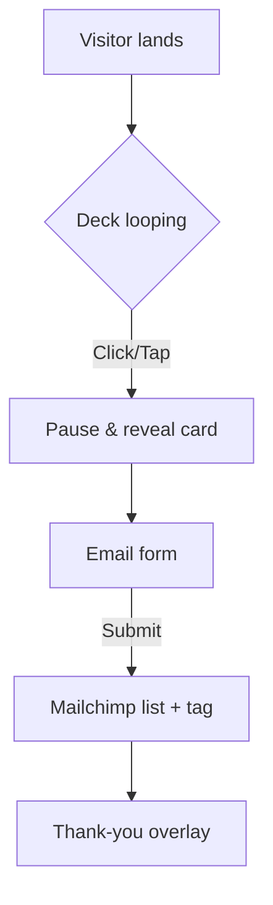

# ✨ Queen de Q – /app Landing Page

## 1  Project Overview

Design & build a magnetic landing page at **queendeq.com/app** that:

1. **Collects verified emails** for the private‑beta "Royal Launch" (places limited).
2. **Immerses visitors in the Kingdom’s vibe** via a looping, stoppable deck of 54 archetype cards.
3. Converts mobile‑first (≥ 375 px) and desktop users equally, with pixel‑perfect, luxurious UI.

> **Primary CTA:** “Deal me a card ↗” → stops the deck → reveals card overlay → opens email form.

## 2  Key Deliverables

* **Hero section** with animated card deck, scarcity copy, and email form.
* **How It Works** 3‑step graphic.
* **Social proof** carousel (quotes, avatars).
* **FAQ accordion** (4–6 common questions).
* **Royal footer** with secondary CTA & legal links.

## 3  User Stories

| Role    | Goal                                               | Reason                            |
| ------- | -------------------------------------------------- | --------------------------------- |
| Visitor | Stop the card shuffle & receive an archetype       | Fun teaser of the future game/app |
| Visitor | Join early‑access list                             | Secure a limited invitation       |
| Admin   | See collected emails in Mailchimp + card drawn tag | Segment future campaigns          |

## 4  Visual Guidelines

* **Palette** (from brand charter):

  * Deep Purple #3B1E50 (bg)
  * Imperial Gold #D6AE60 (CTAs/accent)
  * Rose Champagne #D4B5A5 (hover/secondary)
* **Fonts:** Playfair Display 700 for headings; Inter/Raleway 400–600 for body.
* **Layout:** Large, breathable spacing; glassmorphism cards; soft gold glows.
* **Imagery:** Crown motifs, velvet textures (subtle, low‑opacity), no stock photos.

## 5  Interactive Card Deck

* Build a **spritesheet** (9×6 grid, 54 PNG cards @ 2× & 3× DPR).
* Animate with **GSAP** (`TimelineMax` or `gsap.timeline`) set to `repeat:-1`.
* On `click` or `keydown "Space"`, pause timeline, calculate current frame, reveal card overlay, then auto‑open/spawn the email form.
* Fallback: paused GIF + CSS where JS disabled.
* Accessibility: `aria-live="polite"` announce chosen card; focus‑trap inside overlay.

## 6  Email Capture

* **Mailchimp embedded form** (HTML snippet) inside hero overlay.
* Add hidden input `data-card="{{chosen_card}}"` for segmentation.
* Enable double opt‑in & reCAPTCHA.

## 7  Tech Stack & Tooling

* **Frontend:** Next.js 14, React 18, TypeScript.
* **Styling:** Tailwind CSS with custom variables for palette; @tailwindcss/typography.
* **Animation:** GSAP v3 + `@gsap/sprite` helper or manual `frame()` calc.
* **Forms:** Mailchimp embed + fetch API for graceful failover.
* **Deployment:** Vercel (prod) + preview environments.
* **Analytics:** Vercel Speed Insights (Core Web Vitals) + optional Plausible.

## 8  Performance & SEO

* Lazy‑load GSAP & deck images (`next/dynamic`, `priority` for first frame).
* Use `next/image` for hero background and testimonial avatars.
* Meta: `title`, `description`, Open Graph (og\:image 1200×630).
* Lighthouse targets: ≥ 95 Performance, ≥ 92 Accessibility.

## 9  Accessibility

* Meet WCAG 2.2 AA (focus visible, color‑contrast ≥ 4.5:1).
* All interactive elements reachable via keyboard.
* Reduced‑motion media query: pause deck animation.

## 10  Acceptance Criteria

* Card shuffle is smooth at 60 fps on mobile & desktop.
* Stopping the deck reveals correct archetype 100 % of the time.
* Submitting email shows success message & pushes contact to Mailchimp.
* Page scales beautifully from 375 px to 2560 px.
* No console errors or Lighthouse/axe accessibility violations.

## 11  Nice‑to‑Haves (if time allows)

* Real‑time counter of “scrolls left” synced via Firestore.
* Parallax gold dust on hero scroll.
* Micro‑interaction hovers (gold glow on buttons).

---

**Deliver this file back to me ONLY when you’re ready to start coding.**



🚀 Sprint 0 – Démarrage du développement
Créer src/components/CardDeck.tsx
Importer GSAP v3 (import { gsap } from 'gsap').
Charger la spritesheet temporaire src/assets/sprites/54-cards.png.
Construire un gsap.timeline({ repeat: -1, ease: 'none' }) avec une animation de type steps(54) pour faire défiler les 54 cartes.
Sur click ou keydown("Space"), tl.pause(), calculer currentFrame, puis émettre card:drawn via un onCardDraw(cardName) prop.
Ajouter l’attribut aria-live="polite" pour annoncer la carte tirée.
Coder src/components/SignupForm.tsx
Intégrer l’embed Mailchimp (audience Queen de Q), enlever les styles inline et remplacer par des classes Tailwind.
Ajouter un champ caché data-card qui reçoit la valeur de onCardDraw.
Afficher un toast/overlay “Invitation envoyée ! 📧” après succès.
Assembler la Hero section dans src/layout/Hero.tsx
Fond bg-royalPurple, texte or (text-imperialGold).
Contient <CardDeck onCardDraw={setDrawnCard} /> et <SignupForm drawnCard={drawnCard} />.
Bouton overlay « Deal me a card ↗ » (ou cacher le bouton et déclencher au click sur le deck, à ton choix).
Push & preview
Commit : feat: hero section with animated card deck and mailchimp signup.
Déployer un preview Vercel (vercel --prod facultatif pour l’instant).
Ensuite
Intégrer Framer Motion pour la section “How It Works”.
Mettre en place le carrousel de témoignages (keen-slider).
Ajouter la FAQ accordéon (<details> + Tailwind).

## 🚀 Sprint 2 – Corps de page

> Objectif : finaliser la structure principale après le Hero  
>            (How It Works → Social proof → FAQ + toast de succès)

---

### 1 · Section “How It Works” (3 étapes)

| Étape | Icone/illustration | Texte court (45 caractères max)          |
|-------|--------------------|-------------------------------------------|
| 1     | 🃏 Carte qui tourne | Stop the deck                             |
| 2     | 🔍 Loupe            | Reveal your archetype                    |
| 3     | 👑 Couronne         | Claim royal perks – join the list        |

* **Layout** : flex `flex-col md:flex-row gap-10 items-start md:items-center`
* **Animation** : Framer Motion `whileInView` fade-up + stagger 0.15 s
* **Icones** : `lucide-react` (ou emojis SVG) teintées `text-imperialGold`
* **Background** : `bg-royalPurple/5 backdrop-blur-sm rounded-3xl p-8`

---

### 2 · Testimonials Carousel

* Wrapper : `max-w-3xl mx-auto`
* Slider lib : **Keen-slider** (`npm i keen-slider`)  
  `slidesPerView: 1.1`, `spacing: 24`, `loop: true`
* Card : glassmorphism (`bg-white/5 backdrop-blur-md rounded-2xl p-6`)
* Fields : avatar 48 px, name, 2 lignes de quote max
* Auto-scroll : 6 s, pause on hover, swipe mobile.

---

### 3 · FAQ Accordion

* Semantic HTML :  
  ```html
  <details class="group border-b border-white/10 py-4">
    <summary class="flex justify-between cursor-pointer marker:hidden">
      <span class="text-lg">Is it really free?</span>
      <span class="transition-transform group-open:rotate-180">⌄</span>
    </summary>
    <p class="mt-3 text-sm text-roseChampagne/90">
      Yes. Joining the wait-list costs nothing …
    </p>
  </details>
Tailwind animation : transition-[max-height] duration-300 ease-in-out
4–6 questions max, ordre : prix, nombre de cartes, date de sortie, RGPD.
4 · Mailchimp Success Toast / Overlay
Dans SignupForm.tsx : après status === "success"
Afficher overlay pleine viewport bg-black/70 backdrop-blur-sm.
Carte confetti (import confetti from 'canvas-confetti'; confetti({...})).
Titre : “👑 Welcome to the Realm!” + bouton “Retour”.
Overlay dismissable par Esc ou clic sur X.
A11y : role="alertdialog" + focus-trap sur bouton “Retour”.
5 · Accessibilité & perf
Color-contrast check WCAG AA (Tailwind text-roseChampagne sur bg-royalPurple OK).
prefers-reduced-motion: désactiver slider auto & Framer animations.
Lazy-load Keen-slider (dynamic import) hors FCP.

## 🚦 Sprint 3 – QA, Optimise & Launch

### 1 · Lighthouse & Axe-core audit
- Run `npm run build && npx serve dist` then:
  - **Lighthouse** target ≥ 95 Performance / 100 A11y / 100 Best-Practices / 100 SEO
  - **axe-core** (`npx axe http://localhost:5000`) → zero violations
- Fix any flagged colour-contrast or heading-order issues.

### 2 · Analytics & Events
- Add **Plausible** (or GA4) via `<script defer data-domain="queendeq.com"...>`.
- Fire custom event `card_pick` in `dealCard()` with `plausible('card_pick', {card})`.

### 3 · “Spots left” live counter (optional urgency)
- Create `/api/spots` JSON in `/public` (e.g. `{ "left": 492 }`).
- Fetch on hero mount; display in badge.  
  > Later you can wire this to Firestore for real-time updates.

### 4 · SEO & Social
- `<Head>`:
  ```html
  <title>Queen de Q – Claim Your Throne Early</title>
  <meta name="description" content="Draw your archetype, join the royal wait-list and unlock perks when Queen de Q launches." />
  <meta property="og:image" content="/og-image.png" />
  <link rel="canonical" href="https://queendeq.com/app" />
Generate a 1200 × 630 px og-image.png (purple gradient + golden crown).
5 · Cross-browser & device tests
Chrome, Firefox, Safari (desktop); iOS Safari; Android Chrome.
Viewports: 375 px, 768 px, 1440 px, 1920 px.
Check prefers-reduced-motion: animations pause, page still usable.
6 · Performance tweaks
Dynamic-import Keen-slider (const KeenSlider = (await import('keen-slider')).default).
Add loading="lazy" to testimonial avatars.
Minify Lottie JSON (svg-minify or lottiefiles optimisation).
7 · Environment & deploy
.env.local → VITE_MAILCHIMP_URL, PLAUSIBLE_DOMAIN.
vercel pull && vercel env pull .env.local.
vercel --prod (maps to https://queendeq-landing.vercel.app).
Add production domain alias queendeq.com in Vercel dashboard.
8 · README update
Brief setup + build instructions.
“Known issues / todo” section (e.g. swap placeholder spritesheet with final art).


-----
1. Jeu de 54 cartes (écran clé)
À faire
Extraire les faces et dos du PDF → spritesheet ou dossier /assets/cards/*.png.
Page /cards :
grille statique (6 × 9) ;
clic ⇒ GSAP Flip qui agrandit la carte + panneau latéral “Archetype, punchline, question miroir”.
Bouton “Tirer 1 carte” qui joue l’anim de la pile et ouvre directement la fiche.
Un prototype interactif, même sans persistance, suffit à tester l’UX ; c’est le livrable de référence pour un projet web front-end 
ux.stackexchange.com
userinterviews.com
.
2. Mini-quiz “Quelle Queen es-tu ?”
À faire
8 questions sous forme de boutons-icônes (radio).
Barre de progression animée (motion.div width).
Écran résultat : portrait SVG de la Queen + description (texte du CdC).
Les prototypes de quiz augmentent la compréhension produit et l’engagement dès la phase maquette
tilda.education
linkedin.com
.
3. Écrans placeholder à faible effort
Écran	Contenu statique suffisant pour la démo
Chat “Afternoon Tea”	Fenêtre chat, avatar grand-mère, message “Coming soon…”.
Boutique	Grid 3 cartes + 2 T-shirts mock ; boutons “Ajouter” désactivés.
Journal d’âme	Canvas + 3 stickers drag-and-drop stockés en localStorage.
Ces écrans rassurent le client sur la faisabilité, même sans logique 
elementor.com
reddit.com
.
4. Bandeau “Live Tea Time”
Sticky bottom : “☕ Live Tea Time – 13 juillet, 19 h GMT+1” + ✖ fermer.
Transition translateY en GSAP lors de l’apparition.
Les bannières live sont un livrable courant dans les projets de landing pages 
stoutewebsolutions.com
shanedoyle.io
.
5. PWA & pages légales
manifest.webmanifest + favicon 512 px pour test “Ajouter à l’écran d’accueil”.
Pages Privacy & Terms (Markdown → vite-plugin-md).
Ces livrables complètent la liste réglementaire minimale d’un site vitrine 
reddit.com
elementor.com
.
6. Accessibilité & performance express
Vérifier contraste (WCAG AA) et focus rings.
Lazy-load sprite des cartes et le quiz (import dynamique).
Lighthouse ≥ 90, axe-core sans erreurs.
Des prototypes haute-fidélité mais légers démontrent la valeur UX sans code serveur 
justinmind.com
uxdesigninstitute.com
.----------


  ## 🗂  Sprint — Trois écrans Coming-Soon

### 1. Créer trois routes
| Page | URL | Wrapper full-screen |
|------|-----|---------------------|
| Chat « Afternoon Tea » | /chat | main.min-h-screen.bg-royalPurple.flex.items-center.justify-center.p-6 |
| Journal d’âme | /journal | main.min-h-screen.bg-[#f9f5ef].flex.items-center.justify-center.p-6 |
| Boutique | /shop | main.min-h-screen.bg-royalPurple/5.px-6.py-12 |

---

### 2. Chat « Afternoon Tea »
* Fenêtre 360×540 px, glassmorphisme (`bg-white/10 backdrop-blur-lg rounded-2xl shadow-2xl`).
* Header : avatar grand-mère 👑 + titre **Reine-Mère**.
* Zone messages :  
  * bulle violet utilisateur : « Hello… »  
  * bulle dorée Reine-Mère : **« Coming soon… »**
* Input désactivé, placeholder « Bientôt disponible ».
* Animation d’entrée : fade + slide-up 40 px (500 ms).  
* A11y : `role="dialog"`, focus-trap, Esc ferme la fenêtre.

---

### 3. Journal d’âme
* Canvas 800×500 px (fond papier).  
* 3 autocollants SVG (cœur, pique, couronne) affichés dans une palette latérale.  
* Drag-and-drop basique ; positions sauvegardées en `localStorage`.  
* Toast “Sauvegardé 📒” après drop.  
* Bouton **Reset** qui vide stickers + localStorage.

---

### 4. Boutique mock
* Grid responsive (2 col mobile / 4 col desktop) – 4 produits fictifs.  
* Carte : image placeholder, nom, prix, badge “Exclu Premium”.  
* Filtres décoratifs top (select Catégorie / Prix) non connectés.  
* Bouton **Ajouter** désactivé (`opacity-40 cursor-not-allowed`).  
* Hover : légère élévation + ombre douce.

---

### 5. Accessibilité & performance
* Tous éléments focusables ; aria-labels clairs (« Ouvrir chat », « Déplacer sticker », etc.).  
* `prefers-reduced-motion` : animations remplacées par fade.  
* Images `loading="lazy"` ; pages Lighthouse ≥ 90 Perf / 100 A11y.

---

### 6. Commit & preview
```bash
git add .
git commit -m "feat: coming-soon trio (chat • journal • shop) with placeholder UI"
git push && vercel --prod
