# ✨ Queen de Q – /app Landing Page

## 1  Project Overview

Design & build a magnetic landing page at **queendeq.com/app** that:

1. **Collects verified emails** for the private‑beta "Royal Launch" (places limited).
2. **Immerses visitors in the Kingdom’s vibe** via a looping, stoppable deck of 54 archetype cards.
3. Converts mobile‑first (≥ 375 px) and desktop users equally, with pixel‑perfect, luxurious UI.

> **Primary CTA:** “Deal me a card ↗” → stops the deck → reveals card overlay → opens email form.

## 2  Key Deliverables

* **Hero section** with animated card deck, scarcity copy, and email form.
* **How It Works** 3‑step graphic.
* **Social proof** carousel (quotes, avatars).
* **FAQ accordion** (4–6 common questions).
* **Royal footer** with secondary CTA & legal links.

## 3  User Stories

| Role    | Goal                                               | Reason                            |
| ------- | -------------------------------------------------- | --------------------------------- |
| Visitor | Stop the card shuffle & receive an archetype       | Fun teaser of the future game/app |
| Visitor | Join early‑access list                             | Secure a limited invitation       |
| Admin   | See collected emails in Mailchimp + card drawn tag | Segment future campaigns          |

## 4  Visual Guidelines

* **Palette** (from brand charter):

  * Deep Purple #3B1E50 (bg)
  * Imperial Gold #D6AE60 (CTAs/accent)
  * Rose Champagne #D4B5A5 (hover/secondary)
* **Fonts:** Playfair Display 700 for headings; Inter/Raleway 400–600 for body.
* **Layout:** Large, breathable spacing; glassmorphism cards; soft gold glows.
* **Imagery:** Crown motifs, velvet textures (subtle, low‑opacity), no stock photos.

## 5  Interactive Card Deck

* Build a **spritesheet** (9×6 grid, 54 PNG cards @ 2× & 3× DPR).
* Animate with **GSAP** (`TimelineMax` or `gsap.timeline`) set to `repeat:-1`.
* On `click` or `keydown "Space"`, pause timeline, calculate current frame, reveal card overlay, then auto‑open/spawn the email form.
* Fallback: paused GIF + CSS where JS disabled.
* Accessibility: `aria-live="polite"` announce chosen card; focus‑trap inside overlay.

## 6  Email Capture

* **Mailchimp embedded form** (HTML snippet) inside hero overlay.
* Add hidden input `data-card="{{chosen_card}}"` for segmentation.
* Enable double opt‑in & reCAPTCHA.

## 7  Tech Stack & Tooling

* **Frontend:** Next.js 14, React 18, TypeScript.
* **Styling:** Tailwind CSS with custom variables for palette; @tailwindcss/typography.
* **Animation:** GSAP v3 + `@gsap/sprite` helper or manual `frame()` calc.
* **Forms:** Mailchimp embed + fetch API for graceful failover.
* **Deployment:** Vercel (prod) + preview environments.
* **Analytics:** Vercel Speed Insights (Core Web Vitals) + optional Plausible.

## 8  Performance & SEO

* Lazy‑load GSAP & deck images (`next/dynamic`, `priority` for first frame).
* Use `next/image` for hero background and testimonial avatars.
* Meta: `title`, `description`, Open Graph (og\:image 1200×630).
* Lighthouse targets: ≥ 95 Performance, ≥ 92 Accessibility.

## 9  Accessibility

* Meet WCAG 2.2 AA (focus visible, color‑contrast ≥ 4.5:1).
* All interactive elements reachable via keyboard.
* Reduced‑motion media query: pause deck animation.

## 10  Acceptance Criteria

* Card shuffle is smooth at 60 fps on mobile & desktop.
* Stopping the deck reveals correct archetype 100 % of the time.
* Submitting email shows success message & pushes contact to Mailchimp.
* Page scales beautifully from 375 px to 2560 px.
* No console errors or Lighthouse/axe accessibility violations.

## 11  Nice‑to‑Haves (if time allows)

* Real‑time counter of “scrolls left” synced via Firestore.
* Parallax gold dust on hero scroll.
* Micro‑interaction hovers (gold glow on buttons).

---

**Deliver this file back to me ONLY when you’re ready to start coding.**

```mermaid
flowchart TD
    A[Visitor lands] --> B{Deck looping}
    B -->|Click/Tap| C[Pause & reveal card]
    C --> D[Email form]
    D -->|Submit| E[Mailchimp list + tag]
    E --> F[Thank‑you overlay]
```

🚀 Sprint 0 – Démarrage du développement
Créer src/components/CardDeck.tsx
Importer GSAP v3 (import { gsap } from 'gsap').
Charger la spritesheet temporaire src/assets/sprites/54-cards.png.
Construire un gsap.timeline({ repeat: -1, ease: 'none' }) avec une animation de type steps(54) pour faire défiler les 54 cartes.
Sur click ou keydown("Space"), tl.pause(), calculer currentFrame, puis émettre card:drawn via un onCardDraw(cardName) prop.
Ajouter l’attribut aria-live="polite" pour annoncer la carte tirée.
Coder src/components/SignupForm.tsx
Intégrer l’embed Mailchimp (audience Queen de Q), enlever les styles inline et remplacer par des classes Tailwind.
Ajouter un champ caché data-card qui reçoit la valeur de onCardDraw.
Afficher un toast/overlay “Invitation envoyée ! 📧” après succès.
Assembler la Hero section dans src/layout/Hero.tsx
Fond bg-royalPurple, texte or (text-imperialGold).
Contient <CardDeck onCardDraw={setDrawnCard} /> et <SignupForm drawnCard={drawnCard} />.
Bouton overlay « Deal me a card ↗ » (ou cacher le bouton et déclencher au click sur le deck, à ton choix).
Push & preview
Commit : feat: hero section with animated card deck and mailchimp signup.
Déployer un preview Vercel (vercel --prod facultatif pour l’instant).
Ensuite
Intégrer Framer Motion pour la section “How It Works”.
Mettre en place le carrousel de témoignages (keen-slider).
Ajouter la FAQ accordéon (
 + Tailwind).